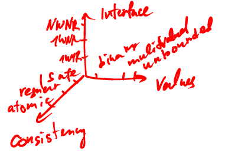
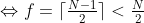
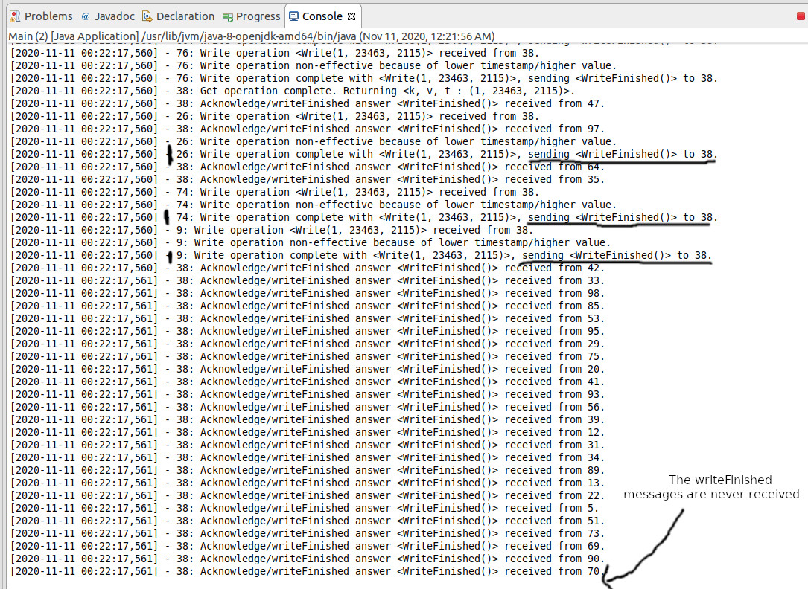
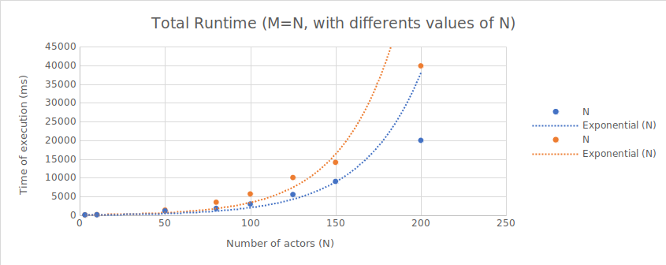
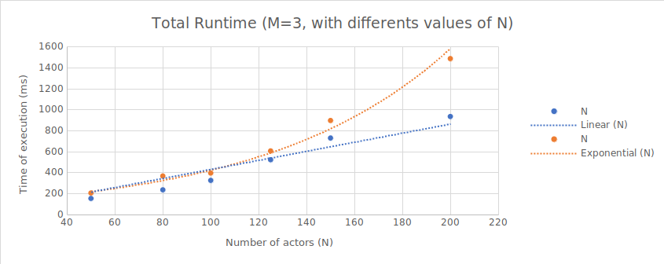
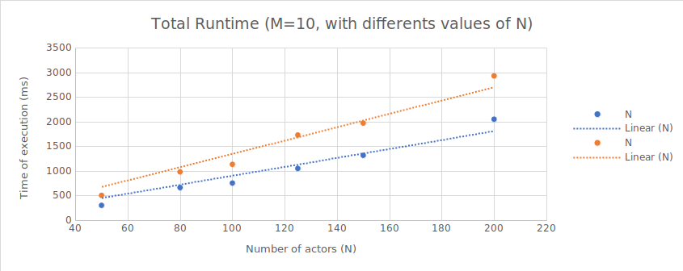
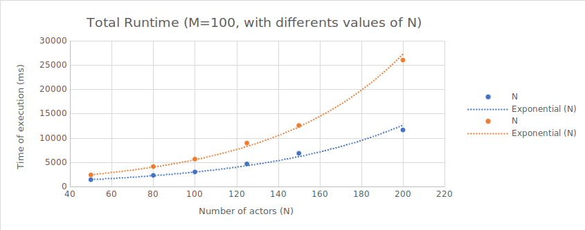
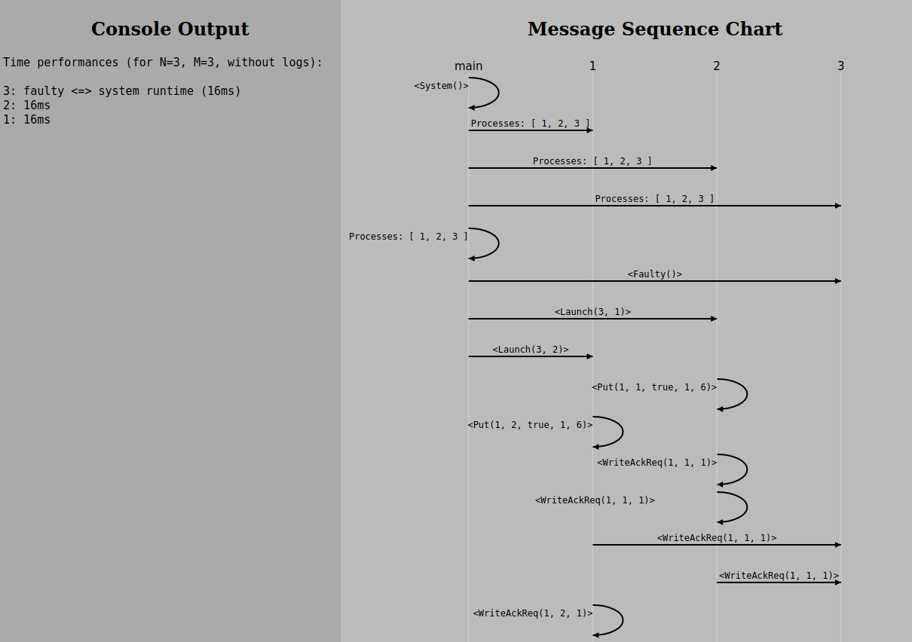

# Distributed Algorithms Project - Robust Key-Value Store

# Introduction
\
&nbsp;&nbsp;&nbsp;&nbsp;&nbsp;&nbsp;The goal of this project is to design a fault-tolerant robust distributed system, assuring both safety ("nothing bad will ever happen") and liveness ("something good will eventually occur"). The implementation consists of a NWNR (N-writers, N-readers) atomic key-value store read-write register, technically the most complicated kind of read-write concurrent register.

<div style="text-align:center">

<p style="padding-top: 10px; font-style: italic;">Our implementation will realize the highest requirements in interface type, consistency, and value system</p>
</div>

&nbsp;&nbsp;&nbsp;&nbsp;&nbsp;&nbsp;To realize such a system, we will use the ABD (Attiya, Bar-Noy, Dolev) algorithm [[1]](#1), using the Akka (Java) framework [[2]](#2). Within the actor model logic of Akka, every actor will have its own copy of the register, and check with others with acknowledgment requests whether the current values it has in its register are "correct" ; though it is impossible to know the "real" values of the system with certainty at any given time (because write and read requests are sent and received with a delay), we will use timestamps to assure the authenticity of registers in the system.

To interact with the key-value store, we will use two "root" methods symbolising the two operations an actor can realize sequentially:
* put(k, v) : assigns the value v to the key k of all the actors' registers (updates the timestamp)
* get(k) : return the value assigned to the key k in the actors' registers (with the latest timestamp)

&nbsp;&nbsp;&nbsp;&nbsp;&nbsp;&nbsp;Because we are using an actor system, it is technically impossible to return the values found by the get operations directly to the Java Main (without using some obscure thread manipulations, which would be technically cheating as well), so we will be content with just printing it out to the log.

&nbsp;&nbsp;&nbsp;&nbsp;&nbsp;&nbsp;Beyond the NWNR, atomic and key-value requirements, we will add another constraint to the system: if less than N/2 processes are faulty (that is, they are unable to respond to message requests from other actors), the system has to still be able to work properly ; as such, we will wait until a quorum of answers from a majority of actors is achieved before proceeding to the next step of an operation. For every execution, we will send a "Faulty" message to N/2

&nbsp;&nbsp;&nbsp;&nbsp;&nbsp;&nbsp;In the report, we will showcase how we converted the ABD pseudo-code to the Akka Actor System, how we assured correctness (i.e. safety, liveness & atomicity) and how we are able to visualize the system automatically after the execution of the program, using a generated sequence message chart.

# Summary

### I - Our Akka Implementation
- **A. Pseudo-code used**
- **B. Initializing the processes**
- **C. Implementation of the put(k,v) method**
- **D. Implementation of the get(k) method**

### II - Proof of Correctness

- **A. Proof of safety**
- **B. Proof of liveness**
- **C. Proof of atomicity**

### III - Performance Analysis

- **A. The Controller Actor & Calculating Runtime**
- **B. Performance Analysis**

### IV - Details Regarding The Implementation & Visualisation Of The Message Sequence

# I - Our Akka Implementation

## A - Pseudo-code used

```python

1  receive(request, sender)
2    send(sender, <timestamp, key, value>)

3  receive(answer, sender)
4    answers.append(curr_answer)
5    if (len(answers_done) <= N/2):
6      max_ts, v = getMaxTimestampValue(answers)
7      send(all, write(max_ts+(1 if curr_operation == "put" else 0),
            (answer.value if curr_operation == "put" else v)))

8    /* The only real difference between the put and the get is that the get sends write requests with the
9       found timestamp/value instead of the current timestamp+1 and the value passed as an argument */

10    answers = []

11  receive(writeAck, sender)
12    answers_done.append(curr_answer)
13    if (len(answers_done) <= N/2):
14      answers_done = []
15      if (curr_operation == "put"):
16        self.waiting_put = false // Frees the actor from the put lock
17        if (curr_write < N):
18          send(self, put(key, value+self.pid))
19        else:
20          get(key)
21      else:
22        self.waiting_get = false // Frees the actor from the get lock
23        if (curr_write < N):
24          send(self, get(key))
25        else:
26          print("end")

27  put(key, value)
28    curr_write++
29    self.waiting_put = true // Starts the put lock (forbids launching of next operation)
30    send_all(request)
31  get(key)
32    curr_read++
33    self.waiting_get = true // Starts the get lock (forbids launching of next operation)
34    send_all(request)

35  getMaxTimestampValue(answers)
36    max_ack = max(answers, sort_by=timestamp)
37    // All actors with max timestamp will have the same value thanks to symmetry breaking
38    return max_ack.timestamp, max_ack.value

39  write(new_timestamp, key, value)
40    /* The method of symmetry breaking we decided to use: taking the smallest value between
41       that sent by the write request and that contained in the actor's register */
42    if(new_timestamp > self.timestamp || (new_timestamp == self.timestamp && value < self.register(key))):
43      self.register(key).value = value
44      self.timestamp = timestamp

45    send(sender, writeAck)
```

&nbsp;&nbsp;&nbsp;&nbsp;&nbsp;&nbsp;We will go into details to explain the pseudo-code inner workings and why it produces a correct robust NWNR atomic register in the second part of this report: "Proof of Correctness".

&nbsp;&nbsp;&nbsp;&nbsp;&nbsp;&nbsp;It is interesting to note that due to the nature of the actor model in concurrent programming, we adapted the original ADB pseudo-code to be neatly divided into individual sequential operations in accordance with the messaging system of the actor model. Each operation requires its own message type to be unambiguously launched after a given message is received, and no wait operation should happen on the inside of single operations; each message is dealt with sequentially, assuring linearisability.

## B - Initializing the processess

&nbsp;&nbsp;&nbsp;&nbsp;&nbsp;&nbsp;First of all, we need to create our actor system and the individual processes. The Java project in itself will be divided into two classes: Main (contains the message classes and the Java Main that will launch the system and return) and MyActor (containing the processes' class definition and onReceive() message manager, with individual methods for each operation for greater clarity).

&nbsp;&nbsp;&nbsp;&nbsp;&nbsp;&nbsp;At the start of the Main, we create our ActorSystem variable named `system` and an `ArrayList` of `akka.ActorRef` instances, named `references`, using the method `system.ActorOf(Props.create(<MyActor constructor>))` that will contain the references to the `MyActor` instances. It is impossible to access attributes of the actors from the `ActorRef` instances, as such is the constraint of the actor model ; the only operation available on an `ActorRef` instance is `instance.tell(msg, sender)`, sending a message "blindly" without any return value possible ; the only acknowledgment conceivable is a response message received from the instance, but in theory such acknowledgments are not certain (cf. Two Generals Problem). We will suppose that all acknowledgments are correctly sent, except of course in the case of the actors with the faulty flag.

&nbsp;&nbsp;&nbsp;&nbsp;&nbsp;&nbsp;The `MyActor` class has 9 main attributes: `id`, an individual id, `self`, its own associated `ActorRef` instance, `N`, the total number of processes, `f`, the number of faulty processes, `processes`, a list of all processes' references, `register`, its version of the current state of the key-value register, `timestamp`, its current last known timestamp and `curr_operation`, an "id" of the current operation in execution in the process (or of the last executed operation) and `state`, a variable containing the current state (faulty=-1, free=0, writing=1, reading=2, awaiting final acknowledgments=3...). The class also has other attributes pertaining to specific operations, logging purposes and system termination.

&nbsp;&nbsp;&nbsp;&nbsp;&nbsp;&nbsp;After creating all the `MyActor/ActorRef` instances, we send to all actors a special message, `Members`, that contains a copy of the `ArrayList` of the system's actors references. The processes receiving the message will now keep in memory the references of the other processes, to be able to send message to all of them spontaneously.

&nbsp;&nbsp;&nbsp;&nbsp;&nbsp;&nbsp;We then create a random ordering of the `ArrayList` `references`, using the actors indices as follows:

```java
List<Integer> actor_indices = IntStream.rangeClosed(0, N - 1).boxed().collect(Collectors.toList());
Collections.shuffle(actor_indices);
```

&nbsp;&nbsp;&nbsp;&nbsp;&nbsp;&nbsp;`actors_indices` will contain a random ordering of the processes, and we can now send our `Faulty` messages to the `(int) ((N-1)/2)` &nbsp;&nbsp;
 &nbsp;&nbsp; first processes ; for the remaining processes, we send another special message, `Launch`, that will start the processes with `M` sequential put and get operations (`M` put and `M` get). The Main then returns, as it cannot further interact with the system (except by sending messages at regular time intervals, but it is of no interest in our implementation).

&nbsp;&nbsp;&nbsp;&nbsp;&nbsp;&nbsp;To assure that the faulty actors don't send messages, we check the actor's `state` at the start of the `onReceive()` method ; if the actor is faulty, it will only process termination messages (i.e. `PoisonPill`).

## C - Implementation of the put(k, v) method

&nbsp;&nbsp;&nbsp;&nbsp;&nbsp;&nbsp;In order to write a new value to the whole system, we will follow the following steps:

0. Receive a `Put` request with given key `k` and value `v`, from the initial `Launch` or the end of previous operations.
1. Send a request to  all the processes (including `self`), to get their value for the key `k` and their latest timestamp (the request contains the `curr_operation` "sequence number" and the value `v` so the initial value is kept in the system)
2. Wait for a quorum of answers, then determine the highest timestamp among the answers
3. Send a `Write` request to all processes (including `send`) with the original value `v`
4. Wait for a quorum of Write acknowledgments (`WriteFinished`).
5. Send a new get operation request (`Get`) to `self` (if requests alternate, or another `Put` request depending on the desired implementation ; stop if `curr_operation` reaches the desired number of operations)

&nbsp;&nbsp;&nbsp;&nbsp;&nbsp;&nbsp;Here are the details of the steps listed above

#### 0 - Put request received

&nbsp;&nbsp;&nbsp;&nbsp;&nbsp;&nbsp;Because we are in an actor model, even the `Put` and `Get` operations have to be dealt with requests: it is not possible to call `actor.put(k,v)`, we need to do the function call trough a message (`actor.tell(request, self)`). The `Put` request arrives in the `onReceive()` method and is redirected to the `putReceived(PutMsg msg, ActorRef sender)` method of the actor. The sender of the message in Akka is obtained with the method `getSender()`, a method that will always return an `ActorRef` because at any point in its existence an actor *must* be currently processing a message.

#### 1 - Send acknowledgment requests

&nbsp;&nbsp;&nbsp;&nbsp;&nbsp;&nbsp;In our implementation, we used two different messages for the timestamp requests for the put & get operations (and also two different messages for the answers) for clarity (and some details of implementation), even though the request process is the same for the two operations. Thus, in the case of the put operation, a `WriteAckReq` message is sent to all actors, while a `WriteAck` message is expected as an answer to establish the quorum; the answer contain the current key `k` and value `v` of the operation (so they are reminded to the sending actor when it receives the answers, having "forgotten" the original request), the current `timestamp` of the actor, the current `value` at the index `k` in the register of the actor, and the `curr_operation` that it just received in the requested. The `curr_operation` sequence number is passed by the message to serve as a secondary timestamp when the answers are received (because answers with the same `k`, `v` and an incoherent `timestamp` could in theory be received from a previous request with a lower `curr_operation` tag ; however such a situation is impossible in our current implementation because all messages from the non-faulty actors must be received in order to establish the quorum), and thus to be sure that the message is relevant to the current operation. After (or before) sending the messages, the sender's `state` is changed to 1, meaning that it is awaiting `WriteAck` acknowledgments; the process is "locked" from further progress in its operations. Actors will receive the `WriteAckReq` messages in the method `writeAckReqReceived()`.

&nbsp;&nbsp;&nbsp;&nbsp;&nbsp;&nbsp;Having a separate state to indicate that the actor is waiting for acknowledgment is useful for debugging purposes, and allows us to ignore irrelevant acknowledgments: if the process receives acknowledgments late but isn't waiting for them anymore because the quorum as already been reached, it will ignore them (in conjunction with `curr_operation`).

#### 2 - Establish the quorum & get the max timestamp

&nbsp;&nbsp;&nbsp;&nbsp;&nbsp;&nbsp;Messages will be received by the `confirmPut()` method one by one, and must be stored in order to know if the quorum has been reached (i.e. `N-f` answers have been received) ; to do so, we use an `ArrayList<WriteAckMsg>` attribute (`curr_ack_put`) in which we successively push the received messages.

&nbsp;&nbsp;&nbsp;&nbsp;&nbsp;&nbsp;*Note: Throughout the program, we try to economise the number of attribute that actors have, and pass information in the messages themselves ; however, to achieve the quorums, the use of internal attributes is unavoidable.*

&nbsp;&nbsp;&nbsp;&nbsp;&nbsp;&nbsp;Every time that a message is received, we check whether it was the one to establish the quorum. Once this condition is reached, we go on to find the highest `timestamp` within the answers. To do so we use the Java `Collections` method `max`.

```java
WriteAckMsg max_ack = Collections.max(curr_ack_write, (a, b) -> ((Integer) a.timestamp).compareTo(b.timestamp));
```

&nbsp;&nbsp;&nbsp;&nbsp;&nbsp;&nbsp;`max_ack` now contains the answer from one of the actors with the highest `timestamp`; technically, all the actors with the highest `timestamp` should have the same value so that the system is correct (which value is the "real" one for the highest `timestamp` would be ambiguous). However, with a naive implementation, if two message with the same `timestamp` and a different value `v` are to be written in multiple actors, there is no way to assure that they will all receive the same value: we need some way to "break the symmetry". We will see below how we assured symmetry breaking. Even though we are sure that with our implementation the symmetry is broken, we still added just in case a stop condition for the operation if multiple answers with the highest `timestamp` have differing values:

```java
boolean same_value_for_max_timestamp = true;
for (WriteAckMsg ack : curr_ack_write) {
  if (ack.timestamp == max_ack.timestamp && ack.v != max_ack.v) {
    same_value_for_max_timestamp = false;
    break;
  }
}

if (same_value_for_max_timestamp) {
  // continue opeartion
} else {
  // cancelling operation
}
```

#### 3 - Send write requests

&nbsp;&nbsp;&nbsp;&nbsp;&nbsp;&nbsp;Having obtained the maximum `timestamp`, the process can now carry on with the operation ; trusting the new timestamp more than its own, it will now send `Write` requests to all the processes (including `self`) with the key `k`, the new value `v` and the new `timestamp` (processes will receive the `Write` messages in the `writeReceived` method). The new `timestamp` is the maximum timestamp incremented by 1, indicating that the current operation is the most recent one:

```java
for (ActorRef ref : processes.references.keySet()) {
  ref.tell(new WriteMsg(msg.k, msg.v, timestamp + 1, ...), self);
}
```

&nbsp;&nbsp;&nbsp;&nbsp;&nbsp;&nbsp;Just like in the case of the `timestamp` acknowledgments, the `state` of the actor is changed to 3, emulating a lock state, while it waits for a quorum of write acknowledgments to be received.

#### 4 - Wait for a quorum while the actors process the Write operations

&nbsp;&nbsp;&nbsp;&nbsp;&nbsp;&nbsp;After the processes receive the `Write` requests, they check whether the `timestamp` is greater than their own: if it is they put the value `v` in their registers at the key index `k`; otherwise, if the `timestamp` is less than their own, the `Write` operation is canceled. The `register` attribute of `MyActor` is a simple `HashMap<Integer, Integer>`.

&nbsp;&nbsp;&nbsp;&nbsp;&nbsp;&nbsp;But if the `timestamp` of the `Write` request is the same as their own, there enters the problem of ambiguity: if message can be received in any order, which value to prioritize (especially knowing that if more than two messages are received, there is no way to know the data of the message that came before the previous one) ; to break the symmetry, we need a function that will always find the same value in the end when successive values are confronted to each other in any set of binary combinations (like a tournament brackets). Such a function must necessarily involve some kind of min/max operation. In our implementation, we decided to use the min function for symmetry breaking.

```java
if (msg.timestamp > timestamp || (msg.timestamp == timestamp && msg.v < register.get(msg.k))) {
  timestamp = msg.timestamp;
  register.put(msg.k, msg.v);
} else {
  // Write operation non-effective because of lower timestamp/higher value
}
```

&nbsp;&nbsp;&nbsp;&nbsp;&nbsp;&nbsp;When the `Write` operation ends for the actor, it sends back a `WriteFinished` acknowledgment to the sender, that will be received in the `writeFinished` method. Just like for the quorum in the case of the `timestamp` acknowledgments, the actor currently doing the operation will wait for `N-f` answers to be received before completing the `put` operation ; `writeFinished` instances are accumulated in the `curr_ack_write` attribute.

&nbsp;&nbsp;&nbsp;&nbsp;&nbsp;&nbsp;Once the `put` operation is complete, the actor's `state` is changed back to 0. Then, depending on the way operations are realized (sequentially or alternating, see part IV.), a following `put` or `get` operation is launched and the cycle continues, or, if the total number of operations that the actor had to realize has been reached, the actor stops and "dies" (see part IV.).

## D - Implementation of the get(k) method

&nbsp;&nbsp;&nbsp;&nbsp;&nbsp;&nbsp;The `get` method is almost exactly the same as the `put` method in the ABD algorithm: the only difference is that the `Write` part of the `get` operation uses the max `timestamp` (instead of the incremented `timestamp`) and the `value` corresponding to the `timestamp` instead of the value `v` passed as the argument of the `put` method:

In `confirmGet()`:

```java
...
for (ActorRef ref : processes.references.keySet()) {
  ref.tell(new WriteMsg(msg.k, max_ack.v, timestamp, ...), self);
}
...
```

&nbsp;&nbsp;&nbsp;&nbsp;&nbsp;&nbsp;Even though the `timestamp` acknowledgment checking part (i.e. the read part) of the `put` and the `get` operation are the same, we decided to use two different methods for clarity as mentioned before. So, the only thing that changes between the two operations is the names of the methods/messages:

- `PutMsg(k,v)` ⇢ `GetMsg(k)`
- `putReceived(msg, sender)` ⇢ `getReceived(msg, sender)`
- `WriteAckReqMsg(k,v)` ⇢ `ReadAckReqMsg(k)`
- `writeAckReqReceived(msg, sender)` ⇢ `readAckReqReceived(msg, sender)`
- `WriteAckMsg(k, v, value, timestamp)` ⇢ `ReadAckMsg(k, value, timestamp)`
- `confirmPut(msg, sender)` ⇢ `confirmGet(msg, sender)`

After that, the final `Write` in both operations is exactly the same (just with different parameters), with the same acknowledgment `WriteFinishedMsg` and reception method `writeFinishedReceived`.

# II - Proof of Correctness

## A. Proof of safety

&nbsp;&nbsp;&nbsp;&nbsp;&nbsp;&nbsp;The safety requirement ("nothing bad will ever happen") of the system is assured by three aspects:

- The symmetry-breaking decision in the write phase of the operations: to avoid an ambiguous situation where multiple values are associated to the same highest timestamp, it is necessary to use a symmetry-breaking operation to determine which value to systematically conserve as the "true" value of the system. Symmetry-breaking doesn't break linearisability, because ignoring later write operations with a non-preferred value is the same as saying that it happened before in the history (which would be a correct history since both write operations must have been concurrent).

- The quorums: because each process waits for the answers of a majority of processes (and we suppose that a majority of processes will always answer to read and write requests correctly), it is sure that the majority of actors that answered to an hypothetical current read operation will intersect with the majority of processes that correctly received and gave their acknowledgment to the last write request that their value have been changed. Thus, it will always be possible to get the real highest timestamp and a coherent value associated to it (thanks to the symmetry-breaking).

- The read phase of the put operation: because a given actor might not have the latest value of the system, it is necessary for actors during a put operation to check with all actors first the latest timestamp.

## B. Proof of liveness

&nbsp;&nbsp;&nbsp;&nbsp;&nbsp;&nbsp;Because we use an actor system and sequentiality in the reception of messages is guaranteed by the Akka framework, and because no method within the code contains wait-like operations (or mutex locks), we can guarantee that no actor will ever get stuck during one of its operations, and will always eventually be available to answer to messages it receives. Knowing that, we can be sure that reading/writing actors will never get stuck waiting for quorums because the other actors *must* eventually answer, even if they are carrying operations. Knowing that, we can assure deadlock-freedom and wait-freedom within our system.

&nbsp;&nbsp;&nbsp;&nbsp;&nbsp;&nbsp;That being said, in some cases, we have noticed that for a high number of actors (N > 80) and multiple messages being sent (M > 3), the system often "freezes" (end thus liveness isn't respected in practice). We have no sure explanation of why this happens, but we suppose it is due to memory problems on our computers or limitations of the Akka framework/of Java threads. We experienced similar problems while testing and we could never debug this issue. Here is an example of an execution when the console application froze:

<div style="text-align:center">

<p style="padding-top: 10px; font-style: italic;">Even though our program has no race conditions and is technically wait-free, the program might hang unexpectedly while it it is obvious that actors should keep receiving messages. In this example, 38 doesn't receive the message from 26, 9 and 74, even though it is still in state 3, able to receive WriteFinishedMsg messages.</p>
</div>

&nbsp;&nbsp;&nbsp;&nbsp;&nbsp;&nbsp;To assure liveness (though safety would then not be assured), we can create a special thread parallel to the system to terminate the `ActorSystem` after a given amount of time (proportional to `N` & `M`) has passed.

&nbsp;&nbsp;&nbsp;&nbsp;&nbsp;&nbsp;***ADDENDUM (11/11/20):***&nbsp; after carefully testing the program without any logging, we ended up identifying that the problem came from the logging library used by Akka (Log4j):

```xml
<appender name="ASYNC"
  class="ch.qos.logback.classic.AsyncAppender">
  <queueSize>1024</queueSize>
  <neverBlock>true</neverBlock>
  <appender-ref ref="STDOUT" />
</appender>
```

&nbsp;&nbsp;&nbsp;&nbsp;&nbsp;&nbsp;By limiting the queue of messages that can be written to 1024 (the asynchronous default), the application might freeze when the queue of messages gets too large. By changing the value to 100 000, we were able to greatly reduce the number of application freezes. However, we noticed that even when we weren't using any kind of logging, crashes would still happen from time to time. The issue isn't completely solved and it is still very strange and unexpected.

## C. Proof of atomicity

&nbsp;&nbsp;&nbsp;&nbsp;&nbsp;&nbsp;The atomicity of our concurrent system is assured by:

- The sequentiality of the operations: because all operations are necessarily sequential because of the way the mailboxes are dealt with by Akka, we are sure that an actor realizes only one operation at a time, and that they wait for two consecutive quorums before finishing their operations, assuring that every operation has a defined start and end.

- The fact that irrelevant messages are ignored: messages from previous operations and write requests with lower timestamps/non-preferred are ignored, signifying that the operation was theoretically finished earlier in the given history.

- Write phase of get operations: the same way that an actor might have the latest value/timestamp during a put operation, an actor might find during the read phase of a get operation that they do not have the latest timestamp; by writing the found latest timestamp/value, they can get up-to-date by the time the get operation finishes (it is assured that the actor will find the latest timestamp/value of the system as mentioned in part II.A).

# III - Performance Analysis

## A. The Controller Actor & Calculating Runtime

&nbsp;&nbsp;&nbsp;&nbsp;&nbsp;&nbsp;To realize a comprehensive performance analysis of the system, we had to overcome one especially important technical problem: knowing when the system terminates and assuring that the execution ends on its own when it is finished (which in a way, is also complementary to liveness). All actors in the Java Framework work as threads who all need to be terminated along with the Java Main in order for the execution to be over; thankfully, the `ActorSystem` method `terminate()` allows to kill all the actor threads without difficulty, but the only problem is that the `ActorSystem` instance of our system stays in the Java Main, and that the Main cannot receive any information from the system actors. To solve this issue, we used "controller" actor that will act on behalf of the `ActorSystem` when interacting with other actors. This actor is defined with a special `System` message containing a direct reference to the `ActorSystem` defined in the Main (that the main actor then puts in its `system` attribute). A reference to the controller actor is then passed to every actors of the system with the `Faulty` and `Launch` messages. When one actor finishes all of its operations, it sends a `CallOfTheVoid` message to the controller, that then understands that the actor is (theoretically) dead and increments a counter of the number of terminated actors, `curr_ack_void`. Once `N-f` `CallOfTheVoid` messages have been received, the controller actor sends `PoisonPill` instances (a special messages that kills the receiving actor as soon as it starts being processed) to actor (including itself) and launches `system.terminate()`.

&nbsp;&nbsp;&nbsp;&nbsp;&nbsp;&nbsp;To actually calculate the runtime, we just need to add a `start` attribute that will be initialized to `System.currentTimeMillis()` in the `MyActor` constructor. When actors finish their operation, they pass the value `System.currentTimeMillis()-start` (the time difference between the end of their operations and their "birth date", i.e. their runtime) with their `CallOfTheVoid` message to the controller, and the controller then stores them in an `HashMap<ActorRef, Long>` attribute, `processes_times`. Before executing `system.terminate()`, the controller outputs the runtime of all actors and the total system runtime (`System.currentTimeMillis()-start` of the controller itself).

## B. Performance Analysis

&nbsp;&nbsp;&nbsp;&nbsp;&nbsp;&nbsp;To perform the performance analysis of the system, we executed the code with different parameters and plotted them with `N`, the number of actor, on the horizontal axis, and the runtime (in milliseconds) on the vertical axis. We executed the program each time manually on the IntelliJ IDE with a computer with the following specifications:

- Processor: AMD Ryzen 3600 (6 Cores, 12 Threads, 3,6 GHz)
- Graphic Card: NVIDIA GTX 2060 Super
- RAM : 16 GB

&nbsp;&nbsp;&nbsp;&nbsp;&nbsp;&nbsp;Here is an example of the output of the runtime of an execution of our program:

```
.../akka-project$ java -jar target/akka-project-1.0-with-dependencies.jar 3 3 y 0 n

[2020-11-11 19:16:28,339] - Slf4jLogger started
[2020-11-11 19:16:28,387] - System started with N=3

[2020-11-11 19:16:28,408] - Time performances (for N=3, M=3, without logs):

[2020-11-11 19:16:28,408] - Total System Runtime: 17ms.
[2020-11-11 19:16:28,408] - 1: 16ms
[2020-11-11 19:16:28,408] - 3: faulty <=> system runtime (17ms)
[2020-11-11 19:16:28,408] - 2: 14ms
```

&nbsp;&nbsp;&nbsp;&nbsp;&nbsp;&nbsp;In total, we took 64 data points for 4 values of `M` (`M=N`, `M=3`, `M=10`, `M=100`), 8 values of `N` (`N=3`, `N=10`, `N=50`, `N=80`, `N=100`, `N=125`, `N=150`, `N=200`), all for two cases: with and without printing logs (as in console applications with many prints a large part of an elongated runtime is due to the printing of data). Here are the graphs we obtained (in orange: with the logs, in blue: without the logs):

<div style="text-align:center">

</div>

<div style="text-align:center">

</div>

<div style="text-align:center">

</div>

<div style="text-align:center">

</div>

&nbsp;

&nbsp;&nbsp;&nbsp;&nbsp;&nbsp;&nbsp;From what we can deduce from the graphs, we estimate that the temporal complexity of our program is simply `O(M*N)` or potentially `O(M*N)^(1+log)` (with `log` being the truth value (0/1) of whether we use logs or not). You can check the detailed results in the file `Performance_analysis.ods`. Generally, it seems our implementation is quite optimized; for 200 actors each sending 200 put and 200 get operations alternating, the program takes 20 seconds to complete (for more than 5 millions of messages exchanged in total, as evidenced by the number of lines in the `log.js` file).

# IV - Details Regarding The Implementation & Visualisation Of The Message Sequence

&nbsp;&nbsp;&nbsp;&nbsp;&nbsp;&nbsp;Other than all the messages classes, receiver methods and actor attributes mentioned in part I. and III., there are many other variables we use for multiple purposes:

- Defining operation schema: we considered that there are two types of operation schemes relevant to the system, alternating put and get operations and consecutive puts followed by consecutive gets. The `getMethod` attribute of `MyActor` (passed as a parameter to the constructor) controls which operation scheme is used: when `getMethod` is true, actors alternate between put and get operations (starting with a put, in total `2*M` operations), and when `getMethod` is false, the actors execute `M` puts followed by `M` gets. For debugging purpose, we also added a variable to disable get operations entirely: `launchGet`. When `launchGet` is true, gets will be launched, otherwise the actor will terminate after `M` puts.

- Knowing details about the current operation: to keep track of the operation, we pass extra arguments to most messages in the system, that will be propagated through the different phases of the operation (reading phase, waiting phase, writing phase...) ; we put the information in the message themselves instead of extra attributes for debugging purposes, to reduce the number of total attributes, and to be able to customize a whole chain of operations with every new `Launch` message.

- Logging: we log the system's executions into4 files: the standard output (`System.out`), a file called `log_console.js`(that formats a JavaScript variable, `history_console`, containing the exact console output lines separated by `<br>` tags), a file called `log.js` (that abstracts the systems behavior in a JavaScript variable, `history_messages`, containing every messages received by the actors in the form of lines `<sender>;<receiver>;<message>` separated by newlines, `\n`) and a file called `perfs.js`, containing a variable (`perfs_history`) summing up of the execution time of every actor and of the system. To log to the standard ouput and `log.js`, we directly used the `logback.xml` file of our project:

```xml
<appender name="STDOUT" target="System.out"
    class="ch.qos.logback.core.ConsoleAppender">
    <encoder>
        <pattern>[%date{ISO8601}] - %msg%n</pattern>
    </encoder>
</appender>

<appender name="FILE" class="ch.qos.logback.core.FileAppender">
    <file>log_console.js</file>
    <append>false</append>
    <encoder class="ch.qos.logback.core.encoder.LayoutWrappingEncoder">
        <layout class="ch.qos.logback.classic.PatternLayout">
            <fileHeader>var history_console = ""</fileHeader>
            <pattern>+ "%msg&lt;br&gt;" %n</pattern>
        </layout>
    </encoder>
</appender>

<appender name="ASYNC"
    class="ch.qos.logback.classic.AsyncAppender">
    <queueSize>10000</queueSize>
    <neverBlock>true</neverBlock>
    <appender-ref ref="STDOUT" />
</appender>

<appender name="FILE_ASYNC"
    class="ch.qos.logback.classic.AsyncAppender">
    <queueSize>10000</queueSize>
    <neverBlock>true</neverBlock>
    <appender-ref ref="FILE" />
</appender>

<root level="INFO">
    <appender-ref ref="ASYNC" />
    <appender-ref ref="FILE_ASYNC" />
</root>
```

&nbsp;&nbsp;&nbsp;&nbsp;&nbsp;&nbsp;Two `PrintWriter` instances for the files `log.js` and `perfs.js` are passed to the actors in their constructor. The lines for `log.js` are printed at the start of the `onReceive()` method, and the runtime are written to `perfs.js` by the controller just before the controller launches `system.terminate()`.

&nbsp;&nbsp;&nbsp;&nbsp;&nbsp;&nbsp;After generating those files, at the end of the execution, a web page is launched automatically to display them. Using an external D3.js library for message sequence charting [[3]](#3), we can then display all the messages of the system in the order in which they were processed in a MSC. Here is an example of a page displayed after an execution without logs.

<div style="text-align:center">

</div>

&nbsp;

&nbsp;&nbsp;&nbsp;&nbsp;&nbsp;&nbsp;Note: using Maven, we generate a JAR for the program that can be found in the folder `target`. The JAR supports command-line arguments, more details in the file `how_to_launch.txt`.

## References
<a id="1">[1]</a>
H. Attiya, A. Bar-Noy, and D. Dolev. "Sharing memory robustly in messagepassing systems". J. ACM, 42(2):124–142, Jan. 1995.

<a id="2">[2]</a>
Akka Team. "Akka Actors Introduction". https://doc.akka.io/docs/akka/current/actors.html#introduction?language=java. Akka.io.

<a id="2">[2]</a>
Michael Shapiro. "Message Sequence Charting for D3". https://github.com/koudelka/d3-message-sequence/. GitHub.
